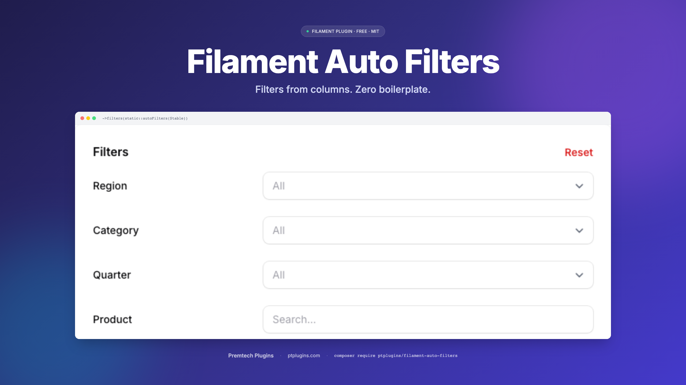

# Filament Auto Filters

<p align="center">
  
</p>

> Automatic table filters for [FilamentPHP](https://filamentphp.com/) **v3, v4, and v5** based on your column definitions. Stop writing repetitive filter code — just define your columns and get smart filters for free.

Single codebase across all three Filament major versions — same trait, same API.

## The Problem

Every Filament resource needs filters. For a typical table with 10 columns, you end up writing 10 filter definitions — most of which follow the same patterns. Date columns get date pickers, text columns get search inputs, relationships get `whereHas` queries.

**Before** (manual filters for each column):

```php
public static function table(Table $table): Table
{
    return $table
        ->columns([
            TextColumn::make('name'),
            TextColumn::make('email'),
            TextColumn::make('department.name'),
            TextColumn::make('hired_at')->date(),
            TextColumn::make('data.position'),
        ])
        ->filters([
            Filter::make('name')
                ->form([TextInput::make('value')->label('Name')])
                ->query(fn (Builder $q, array $data) => /* ... */),
            Filter::make('email')
                ->form([TextInput::make('value')->label('Email')])
                ->query(fn (Builder $q, array $data) => /* ... */),
            Filter::make('department.name')
                ->form([TextInput::make('value')->label('Department')])
                ->query(fn (Builder $q, array $data) => $q->whereRelation(/* ... */)),
            Filter::make('hired_at')
                ->form([DatePicker::make('from'), DatePicker::make('until')])
                ->query(fn (Builder $q, array $data) => /* ... */),
            Filter::make('data.position')
                ->form([TextInput::make('value')->label('Position')])
                ->query(fn (Builder $q, array $data) => /* ... using JSON arrow notation */),
        ]);
}
```

**After** (one line):

```php
->filters(static::autoFilters($table))
```

## Installation

```bash
composer require ptplugins/filament-auto-filters
```

The package auto-discovers its service provider. No manual registration needed.

### Publish Configuration (optional)

```bash
php artisan vendor:publish --tag=auto-filters-config
```

## Quick Start

Add the trait to your Filament resource and call `autoFilters()`:

```php
use PtPlugins\FilamentAutoFilters\Concerns\HasAutoFilters;

class EmployeeResource extends Resource
{
    use HasAutoFilters;

    public static function table(Table $table): Table
    {
        return $table
            ->columns([/* ... */])
            ->filters(static::autoFilters($table));
    }
}
```

That's it. Every `TextColumn` in your table now has a filter.

## Full Example: Employee Management

Let's walk through a real-world scenario. You're building an HR module with an `Employee` model that has direct columns, a `department` relationship, and a JSON `data` column for flexible fields.

### The Model

```php
class Employee extends Model
{
    // Direct columns
    const NAME = 'name';
    const EMAIL = 'email';
    const HIRED_AT = 'hired_at';
    const SALARY = 'salary';

    // JSON data column fields
    const D_POSITION = 'data.position';
    const D_OFFICE = 'data.office';

    // Relationships
    const R_DEPARTMENT_NAME = 'department.name';
    const R_MANAGER_NAME = 'manager.name';

    protected $casts = [
        'hired_at' => 'date',
        'data' => 'array',
    ];

    public function department(): BelongsTo
    {
        return $this->belongsTo(Department::class);
    }

    public function manager(): BelongsTo
    {
        return $this->belongsTo(Employee::class, 'manager_id');
    }
}
```

### The Resource

```php
use Filament\Tables\Columns\TextColumn;
use Filament\Tables\Table;
use PtPlugins\FilamentAutoFilters\Concerns\HasAutoFilters;

class EmployeeResource extends Resource
{
    use HasAutoFilters;

    protected static ?string $model = Employee::class;

    public static function table(Table $table): Table
    {
        return $table
            ->columns([
                TextColumn::make(Employee::NAME)
                    ->label('Name')
                    ->searchable(),

                TextColumn::make(Employee::EMAIL)
                    ->label('Email'),

                TextColumn::make(Employee::R_DEPARTMENT_NAME)
                    ->label('Department'),

                TextColumn::make(Employee::R_MANAGER_NAME)
                    ->label('Manager'),

                TextColumn::make(Employee::HIRED_AT)
                    ->label('Hired')
                    ->date(),

                TextColumn::make(Employee::SALARY)
                    ->label('Salary')
                    ->numeric(),

                TextColumn::make(Employee::D_POSITION)
                    ->label('Position'),

                TextColumn::make(Employee::D_OFFICE)
                    ->label('Office'),
            ])
            ->filters(static::autoFilters($table));
    }
}
```

### What Gets Generated

The plugin inspects each column and generates the right filter type. Detection rules:

| Column | Filter |
|---|---|
| `TextColumn` (date / datetime) | Date range picker (from / until) |
| `TextColumn` (default) | Text search (LIKE `%...%`) |
| `TextColumn` with dot notation `rel.col` | Text search via `whereRelation()` |
| `TextColumn` with `data.X` prefix | Text search via JSON arrow `data->X` |
| `IconColumn->boolean()` | Ternary (Yes / No / All) |
| `SelectColumn->options([...])` | Select filter with same options |
| Other column types | Skipped — pass an explicit filter via `overrides` |

For our Employee example (8 columns), all 8 filters are generated from zero lines of filter code. Same applies to a table mixing `IconColumn` and `SelectColumn` — they get their right filter automatically.

## Overriding Specific Filters

Auto-generated filters are great for most columns. But sometimes you need a `SelectFilter` with specific options, or custom logic. Pass your explicit filters as `overrides` — they replace any auto-generated filter with the same name:

```php
->filters(static::autoFilters($table, overrides: [
    // Replace the auto-generated text filter for department
    // with a select dropdown instead
    static::makeSelectFilter(
        Employee::R_DEPARTMENT_NAME,
        'Department',
        Department::pluck('name', 'name')
    ),

    // Custom filter with your own logic
    SelectFilter::make(Employee::SALARY)
        ->label('Salary Range')
        ->options([
            'junior' => 'Under 50k',
            'mid' => '50k - 100k',
            'senior' => 'Over 100k',
        ]),
]))
```

Result: `department.name` and `salary` use your custom filters. The remaining 6 columns still get auto-generated filters.

## Skipping Columns

Some columns don't need filters. Pass their names in the `skip` array:

```php
->filters(static::autoFilters($table, skip: [
    'deleted_at',
    Employee::SALARY,
]))
```

## Combining Overrides and Skips

```php
->filters(static::autoFilters($table,
    overrides: [
        static::makeSelectFilter(
            Employee::R_DEPARTMENT_NAME,
            'Department',
            Department::pluck('name', 'name')
        ),
    ],
    skip: [
        'deleted_at',
    ]
))
```

**Priority order:**
1. Override filters are always included first
2. Columns matching an override name are skipped (no duplicates)
3. Columns in the `skip` list are skipped
4. Everything else gets an auto-generated filter

## API Reference

### `autoFilters(Table $table, array $overrides = [], array $skip = []): array`

The main method. Inspects every column in the table and generates an appropriate filter for `TextColumn`, `IconColumn->boolean()`, and `SelectColumn`. Other column types are skipped — pass them explicitly via `overrides`.

### `makeTernaryFilter(string $name, string $label): TernaryFilter`

Creates a yes/no/all ternary filter for a boolean column. Handles direct, JSON, and relationship columns the same way as the other helpers.

### `makeSelectFilter(string $name, string $label, array|Closure $options): SelectFilter`

Creates a select dropdown filter that automatically handles:
- **Direct columns** — standard `whereIn` query
- **JSON columns** (`data.xxx`) — uses `attribute()` with arrow notation
- **Relationship columns** (`rel.col`) — uses `whereHas` query

By default, select filters are multiple-choice and searchable (configurable).

### `makeDateRangeFilter(string $name, string $label): Filter`

Creates a date range filter with "from" and "until" date pickers. Handles relationship and JSON columns the same way.

### `makeTextFilter(string $name, string $label): Filter`

Creates a text search filter (LIKE contains). Handles relationship and JSON columns automatically.

### `resolveColumn(string $name): array`

Resolves a column name into its type and query components. Used internally, but available if you need to build custom filters with the same column-detection logic.

Returns:
- `['type' => FilterType::Direct, 'query_column' => 'name']`
- `['type' => FilterType::Relationship, 'relationship' => 'department', 'column' => 'name']`
- `['type' => FilterType::Json, 'query_column' => 'data->position']`

## Configuration

Publish the config file to customize defaults:

```bash
php artisan vendor:publish --tag=auto-filters-config
```

```php
// config/auto-filters.php
return [
    'date_filter_columns'     => 3,          // Form column layout for date range
    'text_search_placeholder' => 'Search...', // Placeholder for text inputs
    'date_format'             => 'd.m.Y',     // Display format in filter indicators
    'select_multiple'         => true,         // Allow multi-select by default
    'select_searchable'       => true,         // Searchable dropdowns by default
];
```

## How Column Detection Works

The plugin uses a simple naming convention to detect column types:

```
name            → Direct column    → WHERE name LIKE '%...%'
hired_at        → Date column      → WHERE hired_at >= ? AND hired_at <= ?
department.name → Relationship     → whereHas('department', fn($q) => $q->where('name', ...))
data.position   → JSON column      → WHERE data->position LIKE '%...%'
```

- **Dot notation** with a `data.` prefix → JSON arrow notation
- **Dot notation** without `data.` prefix → Eloquent relationship
- **No dots** → direct database column
- **Date/DateTime** detection uses Filament's built-in `isDate()` / `isDateTime()` methods on `TextColumn`

## Requirements

- PHP 8.2+
- FilamentPHP **3.x, 4.x, or 5.x** (single codebase across all three)
- Laravel 10, 11, or 12

## License

MIT
